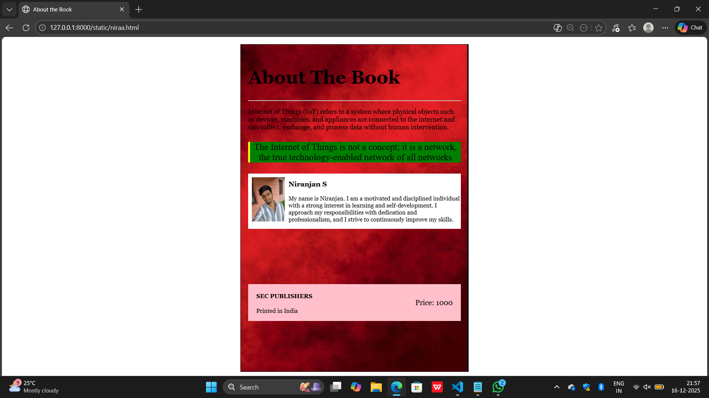

# Ex.05 Book Cover Page Design
## Date:16/12/2025

## AIM:
To design a book back cover page using HTML and CSS.

## DESIGN STEPS:

### Step 1:
Create a Django Admin project.

### Step 2:
Create an app in the Django interface.

### Step 3:
Create a folder named 'static' in the app folder.

### Step 4:
Create a new HTML file in the static folder.

### Step 5:
Write the HTML code with relevant CSS properties.

### Step 6:
Choose the appropriate style and color scheme.

### Step 7:
Insert the images in their appropriate places.

### Step 8:
Publish the website in the LocalHost.

## PROGRAM:
```
niraa.html 
<html>
    <head>
        <title>About the Book</title>
        <link href="style.css" rel="stylesheet">
    </head>
    <body>

        <div class="book">
            <div class="header">
                <h1>About The Book</h1>
                <hr>
            </div>
            <div class="about">
                <p>
                    Internet of Things (IoT) refers to a system where physical objects such as devices,
             machines, and appliances are connected to the internet and can collect, 
             exchange, and process data without human intervention. 

                </p>
            </div>
            <div class="quote">
                <p>
                  The Internet of Things is not a concept; it is a network,
                 the true technology-enabled network of all networks
                </p>
            </div>

            <div class="authorcontent">
            <div class="photo">
            
            </div>

            <div class="author img">
            <h3>Niranjan S</h3>
            <p>
               My name is Niranjan. I am a motivated and disciplined individual 
               with a strong interest in learning and self-development.
                 I approach my responsibilities with dedication and professionalism, and I strive to continuously improve my skills. 
            </p>
        </div>
        </div>
        <div class="ending">
            <div class="under">
            <h4>SEC PUBLISHERS</h4>
            <p>Printed in India</p>
            </div>

            <div class="price">Price: 1000</div>
         </div>
</body>
</html>


        </div>
        </div>

    </body>
</html>

style.css

body {
    margin: 0;
    padding: 0;
    font-family: Georgia, serif;
    color:black;
}
.book {
    width: 618px;
    height: 889px;
    margin: 20px auto;
    background-image: url("image 1.png");
    background-size: cover;
    background-position: center;
    box-sizing: border-box;
    padding: 20px;
    border: 1px solid black;
}
.header{
    text-align: left;
    font-size: 25px;
    margin-top: 40px;
}
.about {
    font-size: 18px;
    font-weight: light;
    color: light black;
    margin-top: 10px;
    
}
.quote {
    text-align: center;
    font-family: italic;
    background-color: green;
    border-left: 5px solid yellow;
    font-size: 25px;
    margin-top: 30px;
    margin-bottom: 30px;
}

.photo{
    height: 120px;
    width: 100px;
    display: flex;
    padding: 10px;
}

.authorcontent{
    display: flex;
    background-color: white;
}

.author img{
    margin-left: 20px;
    font-size: 13px;
}

.ending{
    background-color: pink;
    margin-top: 150px;
    display: flex;
    justify-content: space-between;
    align-items: center;
    padding: 2px;
}

.ending h4{
    color: black;
}

.under{
    margin-left: 20px;
}

.price{
    color: black;
    font-size: 20px;
    margin-right: 20px;
}
```

## OUTPUT:


## RESULT:
The program for designing book back cover page using HTML and CSS is completed successfully.
